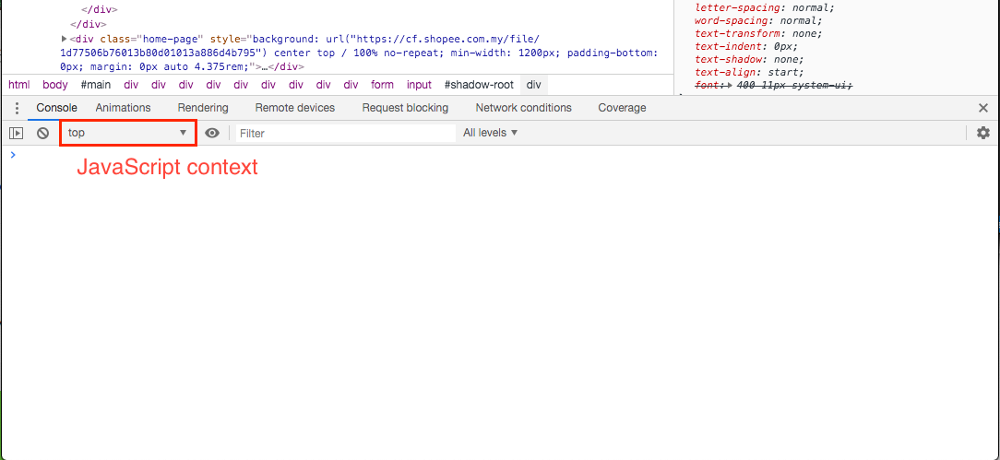
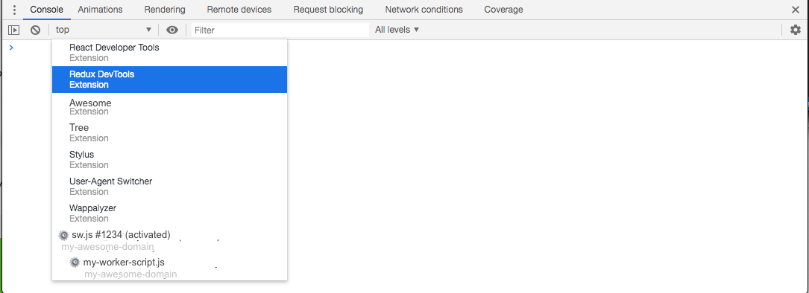
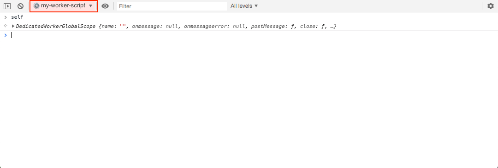
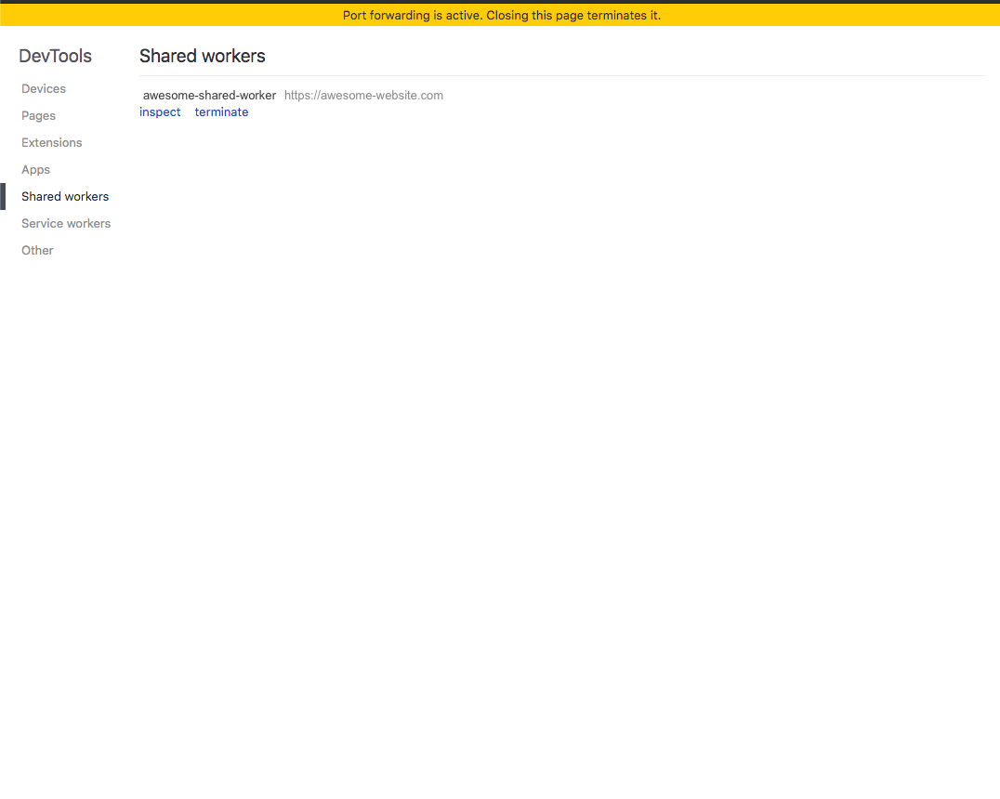
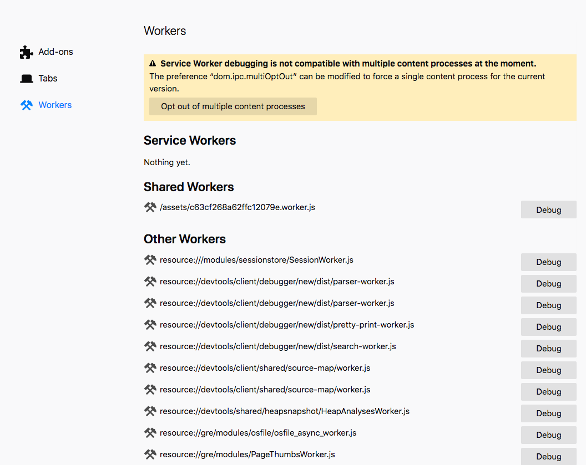
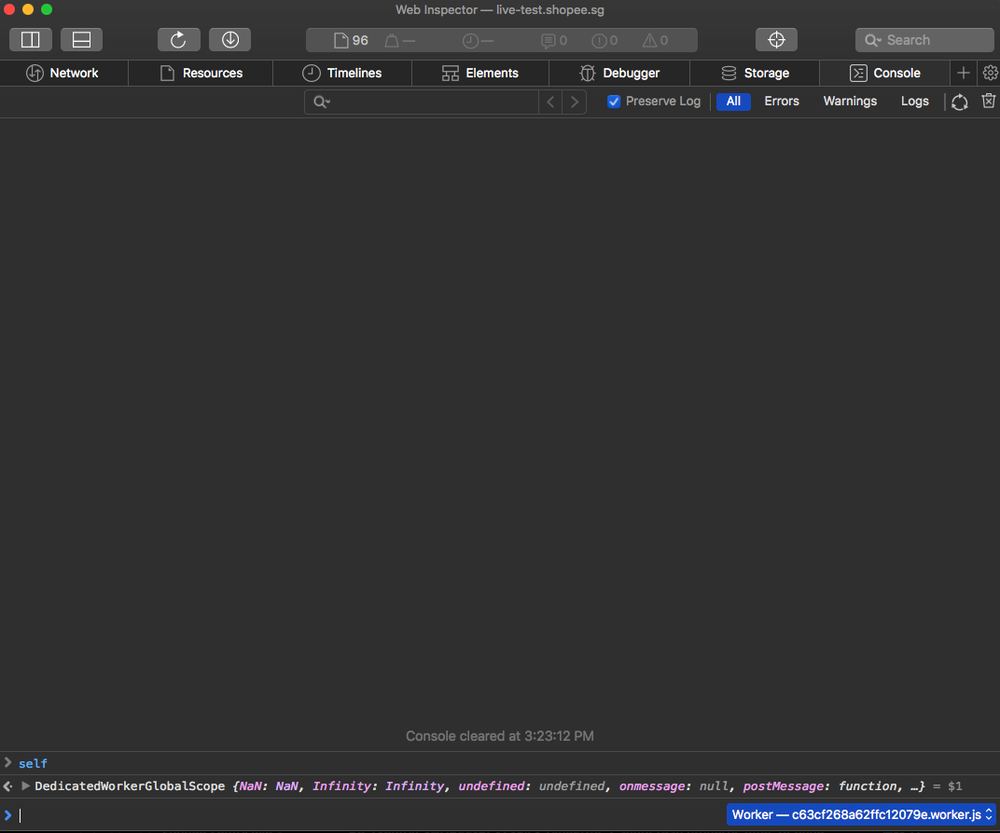

[Web Workers API](https://developer.mozilla.org/en-US/docs/Web/API/Worker) allows you to start a separate worker thread and receives and execute tasks off the main thread.

Since worker runs in a separate worker thread, how would you debug, ie set breakpoint, console log, and inspect your worker script?

Here's how you would do it for various major browsers:

## Chrome

If you are debugging service worker or worker, you can head down to the console. There's a dropdown menu, if you haven't noticed previously, that says "JavaScript context".

For worker context, you would see a cog logo beside the name.

After you choose the worker context, you can type `self` into the console, and you should see `self` is an instance of `DedicatedWorkerGlobalScope` instead of `window`. 

For shared worker, you would need to go to [chrome://inspect/#workers](chrome://inspect/#workers). Select "Shared workers" on the left panel.

You would be able to see a list of shared workers if you have any running.

You can click "inspect", which will open a new console for you to debug.

## Firefox

For Firefox, you could go to [about:debugging#workers](about:debugging#workers). You will be able to see a list of service workers, and shared workers registered to the browser.

## Safari

For Safari, you could find the JavaScript context dropdown at the bottom right corner of your console.

