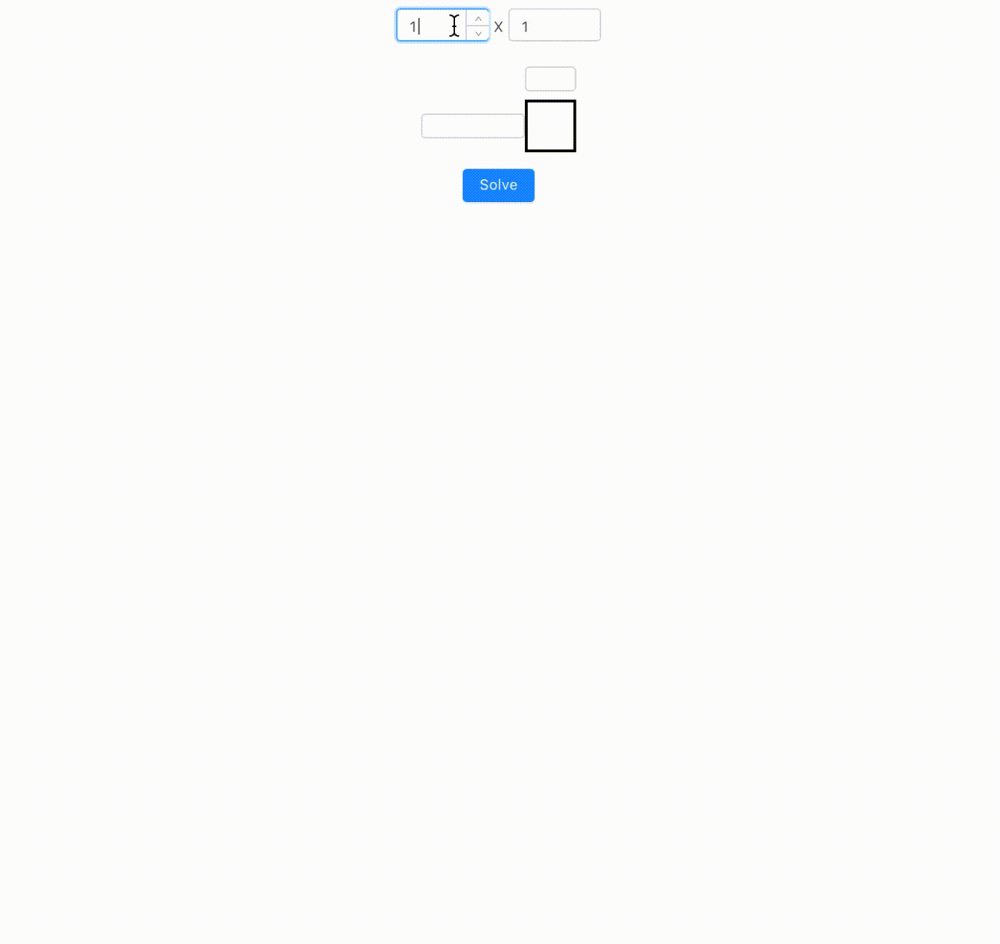
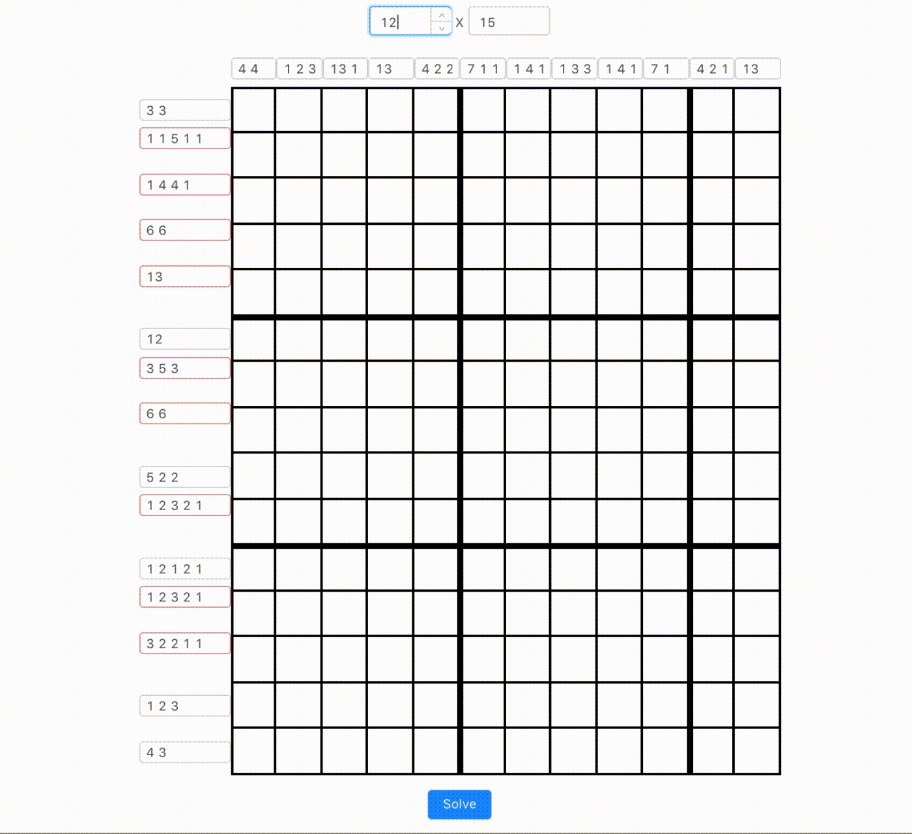

## Background

Last week I was playing [nonogram](https://play.google.com/store/apps/details?id=com.easybrain.nonogram) during lunchtime.

_"I am addicted to this game right now,"_ said me to my colleague, _"If I could come up with a program to solve this, I would stop playing it"_ And then we went into a discussion of algorithms, machine learnings, computer visions...

I can't remember how our topic went from one to another. But one thing stuck to my head, **_I need to write software to solve my nonogram!_**

## The nonogram

[The nonogram](https://en.wikipedia.org/wiki/Nonogram) is a puzzle game with a n x n grid, where the cells must be filled or left blank, according to the numbers at the side of the grid. The number describes how many unbroken lines of filled cells in the given row or column. For example, `"2 4 3"` would mean there are sets of two, four and three filled cells, in that order, with at least one blank cell between successive groups.

## The Frontend

I am a frontend developer, so, I can't resist the temptation to treat everything as if it were a nail with my frontend hammer.

So the first thing I did was to `create-react-app` and get a plain `React` application started.

Next, I had to create the nonogram grids. Initially, I was playing around with `display: inline-block` of divs, until I realised, _hey, this is a good case for [CSS Grids](https://css-tricks.com/snippets/css/complete-guide-grid/)_!



```jsx
// dynamically generate grid template
<div
  style={{
    gridTemplate: getGridTemplate(
      width,
      height,
      blockSize,
      labelXSize,
      labelYSize
    ),
    width: blockSize * width + labelXSize,
    margin: '16px auto',
  }}
>
  {labels}
  {grids}
</div>;

function getGridTemplate(width, height, blockSize, labelXSize, labelYSize) {
  return `${labelYSize}px ${` ${blockSize}px`.repeat(
    height
  )} / ${labelXSize}px ${` ${blockSize}px`.repeat(width)}`;
}
```

One thing cool about CSS grid is that I was no longer limited by the order of the elements within the grid layout, I can position in whichever grid I want by specifying `grid-column` and `grid-row`. So here you see that I can build the `labels` first then the `grids`, freeing myself from building html structure in terms of rows and columns.

The next thing, naturally, was to allow user (just me) to key in the constraints of the nonogram. To make sure what I keyed in is making sense, I added validation to the inputs:



```jsx
function getError(text, max) {
  if (!/^[0-9 ]*$/.test(text)) {
    return 'Invalid characters';
  }
  if (!validateSum(text, max)) {
    return 'Sum exceeded limit';
  }
  return null;
}
```

## The Algorithm

The algorithm I came up with is to exhaustive search and backtracking. What that means in layman terms is to try every possible combinations, validating the board on each step and stop as soon as possible whenever there's no possible step moving forward:

```js
function findSolution(i, j) {
  if (i === height) return true;

  const [nextI, nextJ] = getNextStep(i, j);

  // try to mark the cell with `true` (filled) first
  board[i][j] = true;
  if (verify(board, i, j) && findSolution(nextI, nextJ)) {
    return true;
  }

  // if not possible, mark it with `false` (blank)
  board[i][j] = false;
  if (verify(board, i, j) && findSolution(nextI, nextJ)) {
    return true;
  }

  // if still no solution
  // end this, no possible step moving forward
  return false;
}

findSolution(0, 0);
```

The main gist of the algorithm is at the `verify` function, here are a few considerations I had when writing the `verify` function:

- I am filling the board from left-to-right, top-to-bottom
- I am verifying the board as I am filling, so I need to make sure that the move I made at a cell is still within the constraint of the row/column of the cell
- If I fill the cell, I should not create more line-groups than necessary
- If I fill the cell, I should not make the current line-group longer than necessary
- If I leave the cell blank, I should not make the current line-group shorter than necessary
- When I finished a row / column, I need to make sure the current row / column requirements are all met

I don't want to bore you with the full code over here, you can read it on [my Github repo](https://github.com/tanhauhau/nonogram/blob/dev/src/utils.js#L25-L78) if you curious enough.


## The animation

I built and published [my nonogram solver](https://lihautan.com/nonogram/) and brag about it with my colleagues.

A few days later, another thought came in to my mind, how about showing the nonogram solving steps on the UI. That would be cooler than just solving it!

There's 2 method I could think of:

- Take snapshot of the grid at each step, replay the snapshots as animation
- Record the action taken at each step, replay the actions to build the animation

The 2nd approach sounded like `redux`, by replaying the actions, you can time travel to any state of your UI.

I heeded the 2nd approach, and the results is pretty rad:


```js
// recording the steps
// highlight-next-line
const steps = [];
function findSolution(i, j) {
  if (i === height) return true;

  const [nextI, nextJ] = getNextStep(i, j);

  // try to mark the cell with `true` (filled) first
  board[i][j] = true;
  // highlight-next-line
  steps.push({ mark: true, i, j });
  if (verify(board, i, j) && findSolution(nextI, nextJ)) {
    return true;
  }

  // if not possible, mark it with `false` (blank)
  board[i][j] = false;
  // highlight-next-line
  steps.push({ mark: false, i, j });
  if (verify(board, i, j) && findSolution(nextI, nextJ)) {
    return true;
  }
  return false;
}

// replaying the steps
// highlight-start
for (const step of steps) {
  const nextSolution = getNextSolution(solution, step);
  setSolution(nextSolution);
}

function getNextSolution(state, { mark, i, j }) {
  return [
    ...state.slice(0, i),
    [...state[i].slice(0, j), mark, ...state[i].slice(j + 1)],
    ...state.slice(i + 1),
  ];
}
```

## What's next?

Computer vision recognise the grid so I don't need to manual keying in the numbers?

Automated robotic arms pressing on the screen so I don't have to fill in the solution manually?

¯\\\_(ツ)\_/¯

Well, I'll keep these for another day.