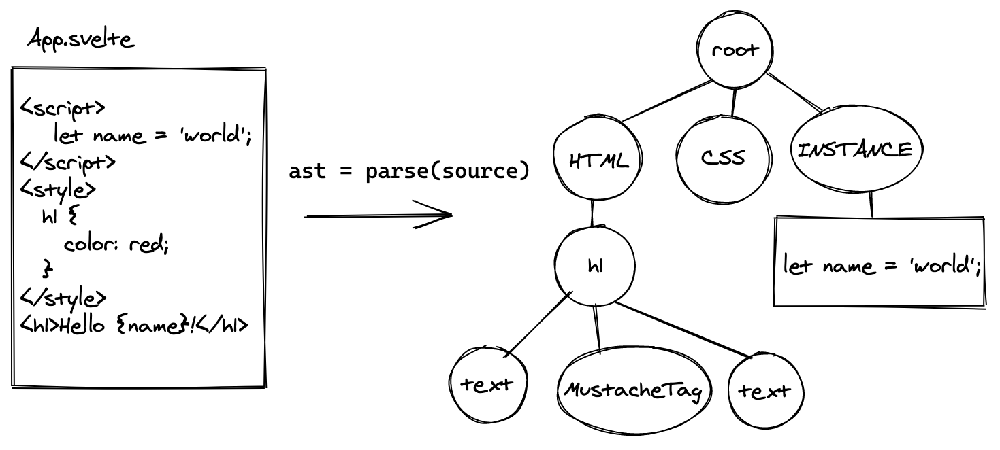
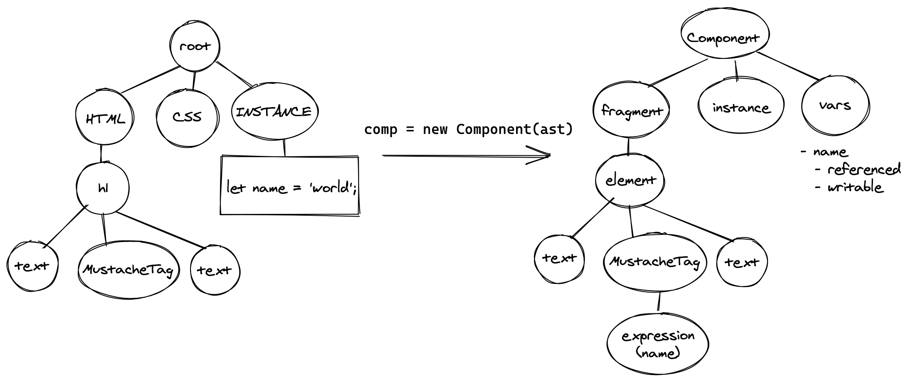
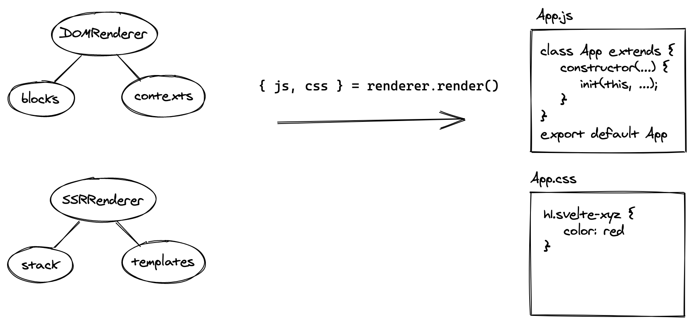

## Who is this for?

Anyone who 
- is interested in the Svelte compilation process
- wants to get started in reading Svelte source code

## Overview


The Svelte compilation process can be broken down into 4-steps

- Parsing source code into Abstract Syntax Tree (AST)
- Tracking references and dependencies
- Creating code blocks and fragments
- Generate code

Which sums out by the following pseudocode:

```js
const source = fs.readFileSync('App.svelte');

// parse source code into AST
const ast = parse(source);

// tracking references and dependencies
const component = new Component(ast);

// creating code blocks and fragments
const renderer =
  options.generate === 'ssr' ? SSRRenderer(component) : DomRenderer(component);

// Generate code
const { js, css } = renderer.render();

fs.writeFileSync('App.js', js);
fs.writeFileSync('App.css', css);
```

## 1. Parsing source code into AST



```js
// parse source code into AST
const ast = parse(source);
```

The Svelte syntax is a superset of HTML. Svelte implements its own parser for the Svelte syntax, which handles:

- HTML syntax `<div>`
- Curly brackets `{ data }`
- Logic blocks `{#each list as item}`

The Svelte parser handles specially for `<script>` and `<style>` tags.

When the parser encounters a `<script>` tag, it uses [acorn](https://www.npmjs.com/package/acorn) to parse the content within the tag. When the parser sees a `<style>` tag, it uses [css-tree](https://www.npmjs.com/package/css-tree) to parse the CSS content.

Besides, the Svelte parser differentiates instance script, `<script>`, and module script, `<script context="module">`.

The Svelte AST look like:

```js
{
  html: { type: 'Fragment', children: [...] },
  css: { ... },
  instance: { context: 'default', content: {...} },
  module: { context: 'context', content: {...} },
}
```

You can try out the Svelte parser in [ASTExplorer](https://astexplorer.net/#/gist/828907dd1600c208a4e315962c635b4a/e1c895d49e8899a3be849a137fc557ba66eb2423). You can find the Svelte parser under **HTML > Svelte**.

### Where can I find the parser in the source code?

The parsing [starts here](https://github.com/sveltejs/svelte/blob/aa3dcc06d6b0fcb079ccd993fa6e3455242a2a96/src/compiler/compile/index.ts#L79), which the parser is implemented in [src/compiler/parse/index.ts](https://github.com/sveltejs/svelte/blob/aa3dcc06d6b0fcb079ccd993fa6e3455242a2a96/src/compiler/parse/index.ts).

### Where can I learn about parsing in JavaScript?

My previous article, ["JSON Parser with JavaScript"](/json-parser-with-javascript) introduces the terminology and guides you step-by-step on writing a parser for JSON in JavaScript.

If this is the your first time learning about parser, I highly recommend you to read that.

## 2. Tracking references and dependencies



```js
// tracking references and dependencies
const component = new Component(ast);
```

In this step, Svelte traverses through the AST to track all the variable declared and referenced and their depedencies.

### a. Svelte creates a `Component` instance.

The `Component` class stores information of the Svelte component, which includes:

- HTML fragment, [`fragment`](https://github.com/sveltejs/svelte/blob/aa3dcc06d6b0fcb079ccd993fa6e3455242a2a96/src/compiler/compile/Component.ts#L52)
- instance script and module script AST and their lexical scopes, [`instance_scope`](https://github.com/sveltejs/svelte/blob/aa3dcc06d6b0fcb079ccd993fa6e3455242a2a96/src/compiler/compile/Component.ts#L54) and [`module_scope`](https://github.com/sveltejs/svelte/blob/aa3dcc06d6b0fcb079ccd993fa6e3455242a2a96/src/compiler/compile/Component.ts#L53)
- instance variables, [`vars`](https://github.com/sveltejs/svelte/blob/aa3dcc06d6b0fcb079ccd993fa6e3455242a2a96/src/compiler/compile/Component.ts#L62)
- reactive variables, [`reactive_declarations`](https://github.com/sveltejs/svelte/blob/aa3dcc06d6b0fcb079ccd993fa6e3455242a2a96/src/compiler/compile/Component.ts#L71)
- slots, [`slots`](https://github.com/sveltejs/svelte/blob/aa3dcc06d6b0fcb079ccd993fa6e3455242a2a96/src/compiler/compile/Component.ts#L94)
- [used variable names](https://github.com/sveltejs/svelte/blob/aa3dcc06d6b0fcb079ccd993fa6e3455242a2a96/src/compiler/compile/Component.ts#L351) to prevent naming conflict when creating temporary variables
- [warnings](https://github.com/sveltejs/svelte/blob/aa3dcc06d6b0fcb079ccd993fa6e3455242a2a96/src/compiler/compile/Component.ts#L43) and [errors](https://github.com/sveltejs/svelte/blob/aa3dcc06d6b0fcb079ccd993fa6e3455242a2a96/src/compiler/compile/Component.ts#L396)
- [compile options](https://github.com/sveltejs/svelte/blob/aa3dcc06d6b0fcb079ccd993fa6e3455242a2a96/src/compiler/compile/Component.ts#L51) and [ignored warnings](https://github.com/sveltejs/svelte/blob/aa3dcc06d6b0fcb079ccd993fa6e3455242a2a96/src/compiler/compile/Component.ts#L44)

### b. Traverse the instance script and module script AST

`Component` traverses the instance script and module script AST to **find out all the variables declared, referenced, and updated** within the instance script and module script.

Svelte identifies all the variables available before traversing the template. When encountering the variable during template traversal, Svelte will mark the variable as `referenced` from template.

### c. Traverse the template

Svelte traverses through the template AST and creates a [Fragment](https://github.com/sveltejs/svelte/blob/aa3dcc06d6b0fcb079ccd993fa6e3455242a2a96/src/compiler/compile/nodes/Fragment.ts) tree out of the template AST.

Each fragment node contains information such as:

**- expression and dependencies**

Logic blocks, `{#if}`, and mustache tags, `{ data }`, contain expression and the dependencies of the expression.

**- scope**

`{#each}` and `{#await}` logic block and `let:` binding create new variables for the children template.

Svelte creates a different Fragment node for each type of node in the AST, as different kind of Fragment node handles things differently:

- [Element node](https://github.com/sveltejs/svelte/blob/aa3dcc06d6b0fcb079ccd993fa6e3455242a2a96/src/compiler/compile/nodes/Element.ts) validates the [attribute](https://github.com/sveltejs/svelte/blob/aa3dcc06d6b0fcb079ccd993fa6e3455242a2a96/src/compiler/compile/nodes/Element.ts#L280), [bindings](https://github.com/sveltejs/svelte/blob/aa3dcc06d6b0fcb079ccd993fa6e3455242a2a96/src/compiler/compile/nodes/Element.ts#L461), [content](https://github.com/sveltejs/svelte/blob/aa3dcc06d6b0fcb079ccd993fa6e3455242a2a96/src/compiler/compile/nodes/Element.ts#L647) and [event handlers](https://github.com/sveltejs/svelte/blob/aa3dcc06d6b0fcb079ccd993fa6e3455242a2a96/src/compiler/compile/nodes/Element.ts#L658).
- [Slot node](https://github.com/sveltejs/svelte/blob/aa3dcc06d6b0fcb079ccd993fa6e3455242a2a96/src/compiler/compile/nodes/Slot.ts) registers the slot name to the `Component`.
- [EachBlock node](https://github.com/sveltejs/svelte/blob/aa3dcc06d6b0fcb079ccd993fa6e3455242a2a96/src/compiler/compile/nodes/EachBlock.ts) creates a new scope and tracks the `key`, `index` and the name of the list to be iterated.
- ...

### d. Traverse the instance script AST

After traversing through the template, Svelte now knows whether a variable is ever being updated or referenced in the component.

With this information, Svelte tries make preparations for optimising the output, for example:

- determine which variables or functions can be safely hoisted out of the `instance` function.
- determine reactive declarations that does not need to be reactive

### e. Update CSS selectors to make style declarations component scope

Svelte updates the CSS selectors, by adding `.svelte-xxx` class to the selectors when necessary.

At the end of this step, Svelte has enough information to generate the compiled code, which brings us to the next step.

### Where can I find this in the source code?

You can start reading [from here](https://github.com/sveltejs/svelte/blob/aa3dcc06d6b0fcb079ccd993fa6e3455242a2a96/src/compiler/compile/index.ts#L83-L90), which the `Component` is implemented in [src/compiler/compile/Component.ts](https://github.com/sveltejs/svelte/blob/aa3dcc06d6b0fcb079ccd993fa6e3455242a2a96/src/compiler/compile/Component.ts).

### Where can I learn about traversing in JavaScript?

Bear with my shameless plug, my previous article, ["Manipulating AST with JavaScript"](/manipulating-ast-with-javascript#traversing-an-ast) covers relevant knowledge you need to know about traversing AST in JavaScript.

## 3. Creating code blocks and fragments


```js
// creating code blocks and fragments
const renderer =
  options.generate === 'ssr' ? SSRRenderer(component) : DomRenderer(component);
```

In this step, Svelte creates a `Renderer` instance which keeps track necessary information required to generate the compiled output. Depending on the whether to output DOM or SSR code *([see `generate` in compile options](https://svelte.dev/docs#svelte_compile))*, Svelte instantiates different `Renderer` respectively.

### DOM Renderer

DOM Renderer keeps track of [a list of blocks](https://github.com/sveltejs/svelte/blob/aa3dcc06d6b0fcb079ccd993fa6e3455242a2a96/src/compiler/compile/render_dom/Renderer.ts#L31) and [context](https://github.com/sveltejs/svelte/blob/aa3dcc06d6b0fcb079ccd993fa6e3455242a2a96/src/compiler/compile/render_dom/Renderer.ts#L28).

A [Block](https://github.com/sveltejs/svelte/blob/aa3dcc06d6b0fcb079ccd993fa6e3455242a2a96/src/compiler/compile/render_dom/Block.ts) contains code fragments for generate the [`create_fragment`](/compile-svelte-in-your-head-part-1/#create_fragment) function.

Context tracks a list of [instance variables](/compile-svelte-in-your-head-part-2/#ctx) which will be presented in the `$$.ctx` in the compiled output.

In the renderer, Svelte creates a [render tree](https://github.com/sveltejs/svelte/blob/aa3dcc06d6b0fcb079ccd993fa6e3455242a2a96/src/compiler/compile/render_dom/wrappers/Fragment.ts) out of the Fragment tree.

Each node in the render tree implements the `render` function which generate codes that create and update the DOM for the node.

### SSR Renderer

SSR Renderer provide helpers to generate [template literals](https://developer.mozilla.org/en-US/docs/Web/JavaScript/Reference/Template_literals) in the compiled output, such as [`add_string(str)`](https://github.com/sveltejs/svelte/blob/aa3dcc06d6b0fcb079ccd993fa6e3455242a2a96/src/compiler/compile/render_ssr/Renderer.ts#L63) and [`add_expression(node)`](https://github.com/sveltejs/svelte/blob/aa3dcc06d6b0fcb079ccd993fa6e3455242a2a96/src/compiler/compile/render_ssr/Renderer.ts#L67).

### Where can I find the `Renderer` in the source code?

The DOM Renderer is implemented in [src/compiler/compile/render_dom/Renderer.ts](https://github.com/sveltejs/svelte/blob/aa3dcc06d6b0fcb079ccd993fa6e3455242a2a96/src/compiler/compile/render_dom/Renderer.ts), and you can check out the SSR Renderer code in [src/compiler/compile/render_ssr/Renderer.ts](https://github.com/sveltejs/svelte/blob/aa3dcc06d6b0fcb079ccd993fa6e3455242a2a96/src/compiler/compile/render_ssr/Renderer.ts).

## 4. Generate code



```js
// Generate code
const { js, css } = renderer.render();
```

Different renderer renders differently.

**The DOM Renderer** traverses through the render tree and calls the `render` function of each node along the way. The `Block` instance is passed into the `render` function, so that each node inserts the code into the appropriate `create_fragment` function.

**The SSR Renderer**, on the other hand, relies on different [node handlers](https://github.com/sveltejs/svelte/blob/aa3dcc06d6b0fcb079ccd993fa6e3455242a2a96/src/compiler/compile/render_ssr/Renderer.ts#L23-L40) to insert strings or expressions into the final template literal.

The render function returns `js` and `css` which will be consumed by the bundler, via [rollup-plugin-svelte](https://github.com/sveltejs/rollup-plugin-svelte) for rollup and [svelte-loader](https://github.com/sveltejs/svelte-loader) for webpack respectively.

## Svelte runtime

To remove duplicate code in the compiled output, Svelte provide util function which can be found in the [src/runtime/internal](https://github.com/sveltejs/svelte/tree/aa3dcc06d6b0fcb079ccd993fa6e3455242a2a96/src/runtime/internal), such as:

- dom related utils, eg: `append`, `insert`, `detach`
- scheduling utils, eg: `schedule_update`, `flush`
- lifecycle utils, eg: `onMount`, `beforeUpdate`
- animation utils, eg: `create_animation`

