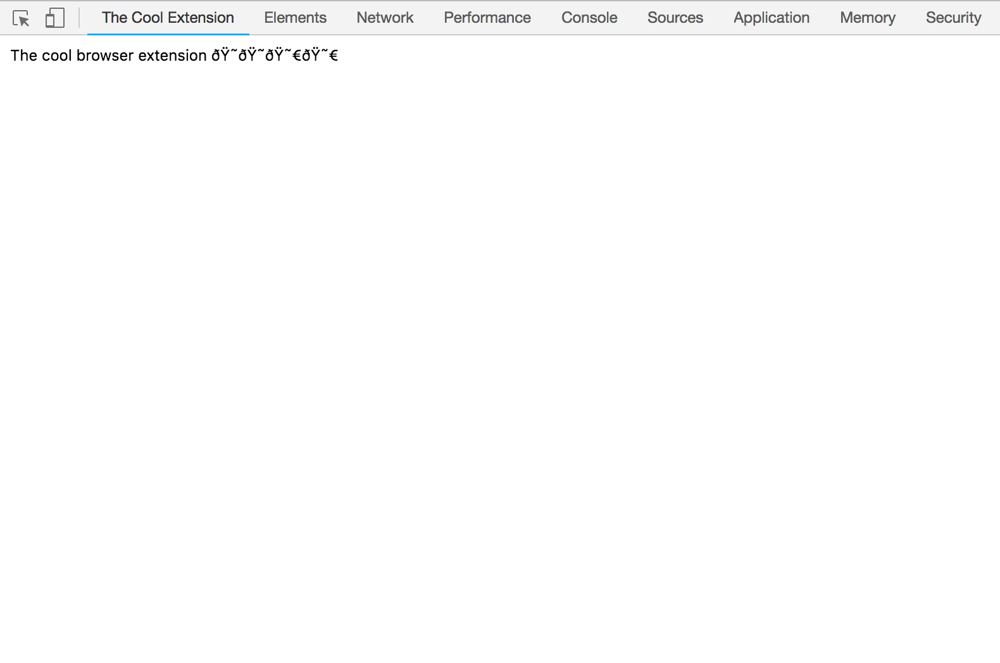
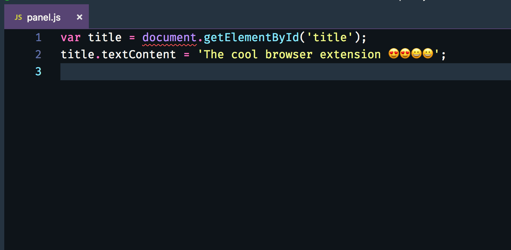
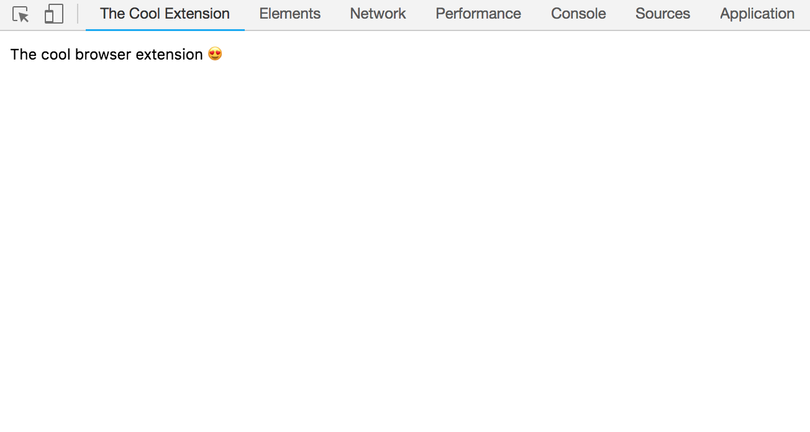
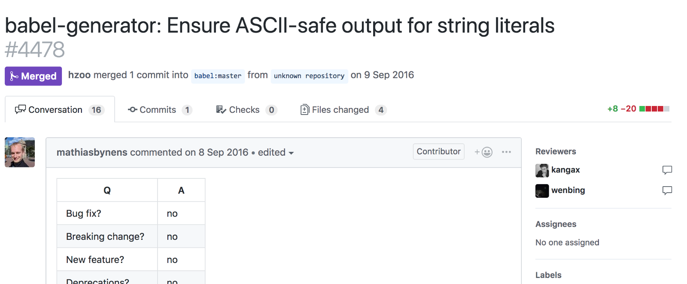

The background story

I was working on a chrome extension, and trying to add some emojis 😍😀😎 into the extension, however I realised the 😍😀😎 are not rendered correctly!



And so I inspect the source code loaded into the chrome extension, it wasn’t loaded correctly as well!


And so I think, probably the encoding issue was caused by the webpack compilation, but, my compiled code looks exactly fine!



So, most likely is a decoding issue when the emoji code get loaded into chrome extension. So I manually changed the emoji in the compiled code to `\ud83d\ude0d` (unicode for 😍). Guess what? The emoji is showing correctly in the chrome extension!



So I changed my source code to manually type in the unicode, and compiled it using webpack. To my surprise, the unicode was compiled back into the emoji (😍) it represents!

I googled around and I found [this fix for babel-generator](https://github.com/babel/babel/pull/4478):



I checked my babel version, and it had included this fix. So what went wrong?

---

My colleague reminded me that during webpack compilation, there are 2 phases, the **transpilation** (via babel) and the **minification** (via uglify plugin).

So I disabled the optimisation in webpack config, and noticed that my compiled code contains the original unicode string (`\ud83d\ude0d`), instead of the emoji (😍) string. So the unicode string was converted to emoji string during minification!

So I went to my favourite [Online JavaScript Minifier](https://skalman.github.io/UglifyJS-online/) (by [skalman](https://github.com/skalman)) to try it out.


After some googling, I [found this issue](https://github.com/mishoo/UglifyJS2/issues/490) which described my scenario perfectly.


Turned out there is a `ascii_only` for [output options](https://github.com/mishoo/UglifyJS2#output-options), and it is default to `false`. So I set `ascii_only` to `true`, ran webpack, and checked my compiled code, it contained the unicode string (`\ud83d\ude0d`)! And even when I wrote emoji string (😍) in my source code, it got compiled to unicode as well.

```js
const UglifyJsPlugin = require('uglifyjs-webpack-plugin');

module.exports = {
  //...
  optimization: {
    minimizer: new UglifyJsPlugin({
      uglifyOptions: {
        // highlight-start
        output: {
          // true for `ascii_only`
          ascii_only: true
        },
        // highlight-end
      },
    }),
  },
}
```

---

## TIL: UglifyJs ascii_only option, use it when you want to escape Unicode characters.

---

Why is there a `ascii_only` option?

My guess is that it takes less space for a unicode character (16–17bit) than the escaped ascii characters (6 * 8 bit — 12 * bit), that’s why using unicode character is the default option (`ascii_only=false`).