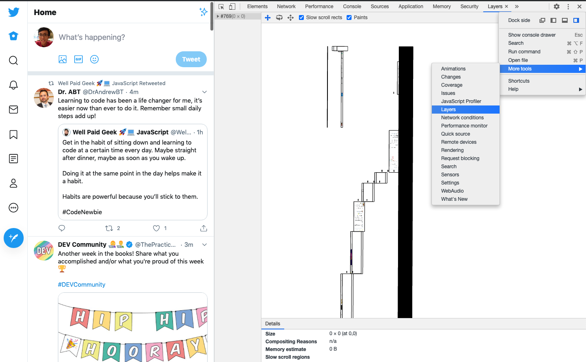

---
tags:
  - z-index
---

1️⃣ Natural stacking order

- Order of the element in the DOM.
- Last child in DOM tree appears in the frontmost
- CSS grid when assigning mutliple elements into the same grid, order on top depending on order in DOM tree
- `flex-direction: reverse` does not change the stacking order

2️⃣ z-index
- can be positive / negative
- need to set position other than static, in order to work
  * need a position to make z-index to have context
- why z-index not working, position

3️⃣ negative z-index
- negative z-index goes behind the parent.
- html tag has base z-index, you can't go behind the `<html>`

4️⃣ Highest z-index value
- not mentioned in spec, but limited by the type of variable used to store them (32-bit signed integer)
- 2^31 - 1

5️⃣ Debugging z-index
- Layers panel 
- visbug /zindex plugin 
- visbug /pesticide plugin 

6️⃣ Manage z-index
- using css custom properties
- name your z-index

```css
:root {
  --dialog-z-index: 1;
  --popup-z-index: 2;
}

.my-popup {
  z-index: var(--popup-z-index);
}

.my-dialog {
  z-index: var(--dialog-z-index);
}
```

7️⃣ stacking context
- html create the 1st stacking context
- To create stacking context
  - position + z-index not auto
  - when creating composite layer - filters, opacity, transform, will-change


- <select> element dropdown always popup no matter 