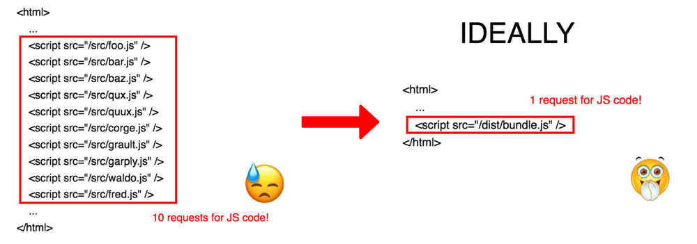
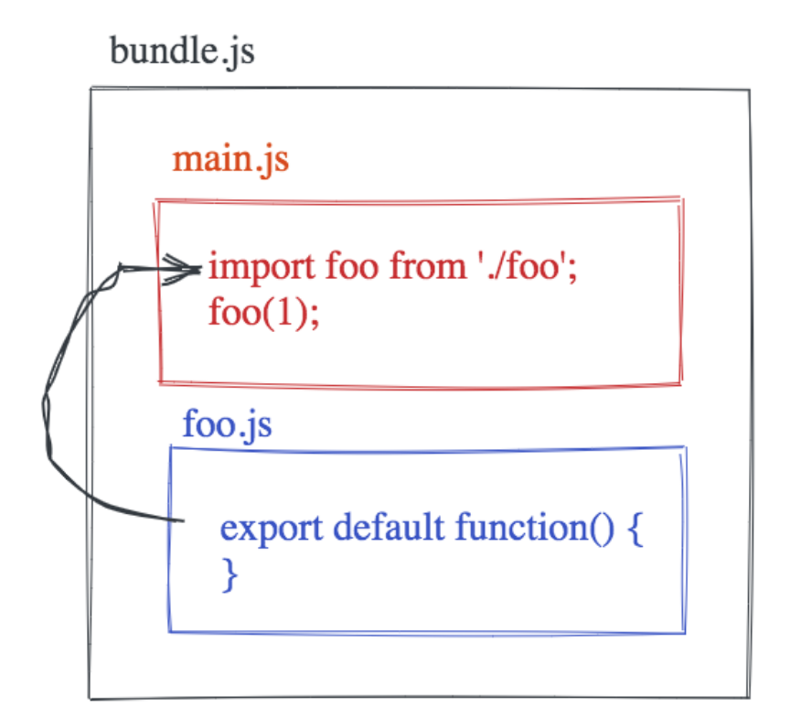
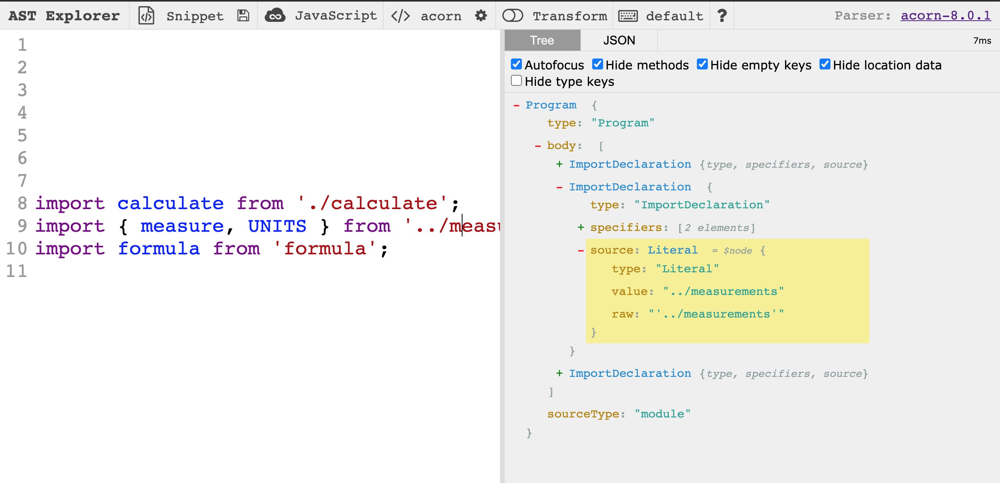
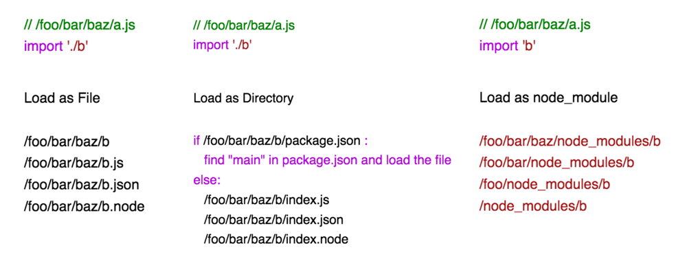

## Background

We are trying out a new form of our weekly sharing, which is interest group-based.

I am hosting the **"Building a simplified webpack clone"** interest group, which lasted 8 weeks, and every week, we will cover 1 concept of webpack and an assignment to implement that concept ourselves.

## Prior Art

- 📺 [Tobias Koppers](https://twitter.com/wSokra) - bundling live by hand - https://youtube.com/watch?v=UNMkLHzofQI
- 📺 [Ronen Amiel](https://twitter.com/ronenamiel) - build your own webpack - https://youtube.com/watch?v=Gc9-7PBqOC8
- 📖 adam kelly - https://freecodecamp.org/news/lets-learn-how-module-bundlers-work-and-then-write-one-ourselves-b2e3fe6c88ae/

## Week 1 - Resolving

### Why module bundler?

We love writing small modular JS files, but that shouldn't impact the users.

Traditionally with limit on number of request connection, 🐌 slow internet speed, we want to combine all the code into 1 file -> 1 network request



🕰 Traditionally, we concatenate the source files into 1 big output file.

But that begs the question

- ❓ what should be the order of concatenation (files may depend on each other) ?
- ❓ what if there's var naming conflict across files?
- ❓ what if there's unused file?

💡 That's why we need a module system to define the relationship among the JS modules



So now, let's take a look how we can start building a module dependency graph

### 1. We start from an entry file.

This is the starting point of the application

### 2. We read the file and determine what is being imported into this file

```js
import calculate from './calculate';
import { measure, UNITS } from '../measurements';
import formula from 'formulas';

const oneCm = measure(1, UNITS.CM);
const result = calculate(formula, oneCm);
```

In the example above, the following is imported:

- `'./calculate'`
- `'../measurements'`
- `'formulas'`

we can spot the import from our human eye 👀, but how can computer 🤖 do that for us?

🤖 can parse the code in string into Abstract Syntax Tree (AST), something representing the code that 🤖 can understand.

in AST, import statement is represented by a node with:

- `type` = "ImportDeclaration"
- `source.value` = the filename it's trying to import



There are various JavaScript parser out there, here are some of them

- 🔗 [babel](https://babeljs.io/docs/en/babel-core)
- 🔗 [acorn](https://github.com/acornjs/acorn)
- 🔗 [esprima](https://github.com/jquery/esprima)
- 🔗 [es-module-lexer](https://github.com/guybedford/es-module-lexer)

```js
// babel
const babel = require('@babel/core');
babel.parseSync(code);

// acorn
const acorn = require('acorn');
acorn.parse(code, { ecmaVersion: 2020, sourceType: 'module' });

// esprima
const esprima = require('esprima');
esprima.parseScript(code);

// if you just need the import & export
// es-module-lexer is blazing fast, it is written in c, and loaded through web-assembly
// is what powers vite for parsing dependencies
const { init, parse } = require('es-module-lexer');
await init;
const [imports, exports] = parse(code);
```

...and if you forgot about your tree-traversal algorithm 😨, here are some libraries that can help you out

- 🔗 [babel-traverse](https://babeljs.io/docs/en/babel-traverse)
- 🔗 [acorn-walk](https://github.com/acornjs/acorn/tree/master/acorn-walk)
- 🔗 [estree-walker](https://github.com/Rich-Harris/estree-walker)

```js
// babel
const traverse = require('@babel/traverse').default;
traverse(ast, {
  ImportDeclaration(node) {},
});

// acorn
walk.simple(ast, {
  ImportDeclaration(node) {},
});

// estree-walker
const { walk } = require('estree-walker');
walk(ast, {
  enter(node) {},
  leave(node) {},
});
```

Some other useful links

- Inspect your AST
  - https://astexplorer.net
  - https://lihautan.com/babel-ast-explorer/
- The JS AST Specification
  - https://github.com/estree/estree
- Guide on parsing, traversing AST
  - https://lihautan.com/manipulating-ast-with-javascript
  - https://lihautan.com/json-parser-with-javascript

### 3. Now knowing what are the names you are importing from, you need to figure out their actual file path

that depends on

- the current file path
- the name you are importing from

```js
resolve('a/b/app.js', './calculate.js');
// a/b/calculate.js
resolve('a/b/app.js', '../measurements.js');
// a/measurements.js
resolve('a/b/app.js', 'formulas');
// node_modules/formulas/src/index.js
```

That leads us to the [Node.js Module Resolution Algorithm](https://nodejs.org/api/modules.html#modules_all_together)

It describes the steps taken to resolve the file.

there are 3 scenarios in general:

- load as file
- load as directory
- load as node_modules



Some other module resolution:

- webpack uses [`enhanced-resolve`](https://github.com/webpack/enhanced-resolve) which is a highly configurable resolver
- Typescript implements its own resolver, [see how TS resolving works](https://typescriptlang.org/docs/handbook/module-resolution.html)

### 4️⃣ After you figured the file path you're importing from, for each of the file, 🔁 repeat step 2️⃣ until no more new files to be found.

### Assignment

[Test cases](https://github.com/tanhauhau/rk-webpack-clone)

For each test cases, we provide the entry file, and we expect

📝 Module

- `filepath`
- `dependencies` -> list of Depedencies (see below 👇)
- `isEntryFile` -> `true` if it is the entry file / `false` otherwise

📝 Depedencies

- `module` (see above ☝️)
- `exports` -> list of var names you are importing, eg "default", "measure" ..

📝 If 2 module are importing the same module, both should be referring to the same module instance

```js
moduleCFromModuleA === moduleCFromModuleB;
```

📝 Be careful with circular dependency 🙈

## Week 2 - Bundling

🤔 How do you bundle modules into 1 file?

After studying the 2 most popular bundlers, webpack and rollup, i found that the way they bundle are very different.

Both of them come a long way, I believe both has its own pros and cons

```js
// circle.js
const PI = 3.141;
export default function area(radius) {
  return PI * radius * radius;
}

// square.js
export default function area(side) {
  return side * side;
}

// app.js
import squareArea from './square';
import circleArea from './circle';

console.log('Area of square: ', squareArea(5));
console.log('Area of circle', circleArea(5));
```

### 🔭 Observation: Bundle using webpack

- 📝 each module wrap in a function
- 📝 a module map, module identifier as key
- 📝 a runtime glue code to piece modules together
- 📝 calling module function, with 2 parameters, 1 to assign the exports of the module, 1 to "require" other modules

```js
// webpack-bundle.js
const modules = {
  'circle.js': function(__exports, __getModule) {
    const PI = 3.141;
    __exports.default = function area(radius) {
      return PI * radius * radius;
    }
  },
  'square.js': function(__exports, __getModule) {
    __exports.default = function area(side) {
      return side * side;
    }
  },
  'app.js': function(__exports, __getModule) {
    const squareArea = __getModule('square.js').default;
    const circleArea = __getModule('circle.js').default;
    console.log('Area of square: ', squareArea(5))
    console.log('Area of circle', circleArea(5))
  }
}
webpackRuntime({
  modules,
  entry: 'app.js'
});
```

#### 🔭 Observation: Bundle using rollup

- 📝 much flatter bundle
- 📝 module are concatenated in topological order
- 📝 exports and imports are removed by renaming them to the same variable name
- 📝 any variable in module scope that may have naming conflict with other variables are renamed

```js
// rollup-bundle.js
const PI = 3.141;

function circle$area(radius) {
    return PI * radius * radius;
}
function square$area(side) {
    return side * side;
}

console.log('Area of square: ', square$area(5));
console.log('Area of circle', circle$area(5));
```

### 📤 Output target of bundling

- IIFE (the most common target, we want to execute the script)
- CJS, ESM, UMD, AMD, ... (we want to bundle a library, exports of entry file is exported in selected module format)

- 🔗 https://webpack.js.org/configuration/output/#outputlibrarytarget
- 🔗 https://rollupjs.org/guide/en/#configuration-files

### Assignment

[Test cases](https://github.com/tanhauhau/rk-webpack-clone)

Here are some of the the interesting test cases:

🧪 Able to handle re-export nicely

```js
// a.js
export * as b from './b';
export * from './c';
export { d } from './d';

// main.js
import * as a from './a';

console.log(a);
```

🧪 Importing the same file twice, but are you able to make sure it's gonna be evaluated only once?

```js
// a.js
import './c';

// b.js
import './c';

// c.js
console.log('c.js');

// main.js
import './a';
import './b';
```

🧪 The dreaded circular dependency, are you able to make sure to get the value of `a`, `b`, `c` in all the files?

```js
// a.js
import { b } from './b';
import { c } from './c';

export const a = 'a';

setTimeout(() => {
  console.log(`a.js | b=${b} | c=${c}`);
});

// b.js
import { a } from './a';
import { c } from './c';

export const b = 'b';

setTimeout(() => {
  console.log(`b.js | a=${a} | c=${c}`);
});

// c.js
import { a } from './a';
import { b } from './b';

export const c = 'c';

setTimeout(() => {
  console.log(`c.js | a=${a} | b=${b}`);
});

// main.js
import { a } from './a';
import { b } from './b';
import { c } from './c';

setTimeout(() => {
  console.log(`main.js | a=${a} | b=${b} | c=${c}`);
});
```

🧪 Are you able to export a variable before it is declared? Does the order matter?

```js
// a.js
let a = 'a';

export { a, b };

let b = 'b';

// main.js
import { a, b } from './a';

console.log('a = ' + a);
console.log('b = ' + b);
```

🧪 imported variables is not a normal variable, it's a live binding of the exported variable. Are you able to make sure that the value of `count` is always up to date?

```js
// data.js
export let count = 1;

export function increment() {
  count++;
}

// a.js
import { count, increment } from './data';

console.log('count = ' + count);
increment();
console.log('count = ' + count);

// b.js
import { count, increment } from './data';

console.log('count = ' + count);
increment();
console.log('count = ' + count);

// main.js
import './a';
import './b';
```

📝 Be careful with circular dependency 🙈


### 🔨 Manipulating AST
📖  [manipulating ast with javascript](https://lihautan.com/manipulating-ast-with-javascript/) (generic)
📖  [babel plugin handbook](https://github.com/jamiebuilds/babel-handbook/blob/master/translations/en/plugin-handbook.md) (babel)
