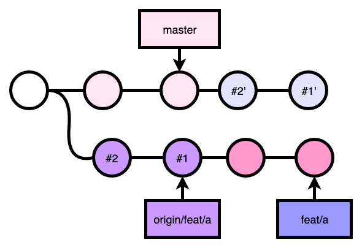
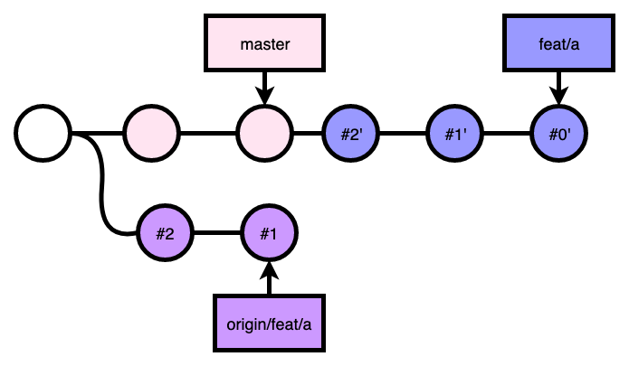
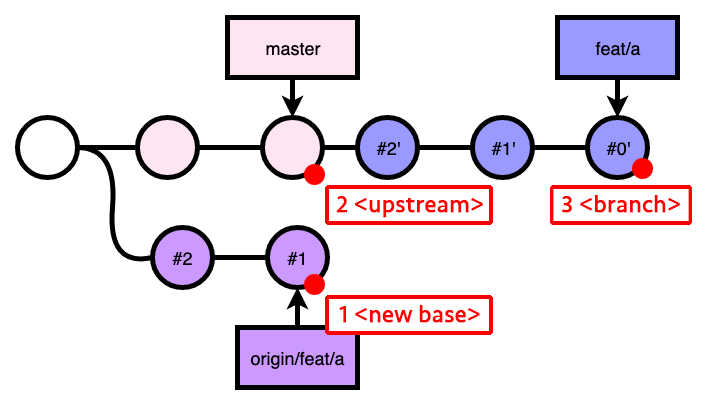

Last week, I [shared about git commands](/git-gudder/) at [Shopee React Knowledgeable](https://github.com/Shopee/shopee-react-knowledgeable). At the end of the talk, one of my colleague approached me and asked me about git rebase. She somehow ended up with a messed up git history with `git rebase`, and she couldn't comprehend how she ended up there.

I found that her scenario was interesting, and decided to write it out here.

This was what she told me:

> I branched out `feat/a` branch from `master` and made a few commits (`commit #1`, `commit #2`).
>
> I noticed that master branch has new commits, so I pulled `master` branch, and rebased my branch `feat/a` onto master branch.
>
> Then, instead of `git push --force` my local `feat/a` to remote `origin`, I `git pull --rebase origin feat/a`.
>
> And, my commits on `feat/a`, eg `commit #1`, `commit #2` were gone!
>

So, we expected to see `commit #1`, `commit #2` at `HEAD` after rebasing onto `origin/feat/a` after the `git pull --rebase`, yet, the only commits we saw were a bunch of commits from the `master` branch.

To understand what happened, I decided to draw diagrams to visualize what had happened:


So, the first thing she did was to `git rebase` `feat/a` on top of `master`:


So far, everything looked normal. The next command was the tricky one.

She rebased `feat/a` on top of `origin/feat/a`, she ran:

```
$ git checkout feat/a
$ git rebase origin/feat/a
```

The most important thing on `git rebase` is the 3 reference points of rebasing:


So, when she typed 

```
$ git rebase origin/feat/a
```

, it meant:

```
$ git rebase --onto origin/feat/a origin/feat/a feat/a
```

- `new base`: `origin/feat/a`
- `upstream`: `origin/feat/a`
- `branch`: `feat/a`


So what happened was all the commits in master after branching out `feat/a` all the way to the newly rebased commits in `feat/a` were rebased onto `origin/feat/a`:


However, if you look at the history right now, the commit `commit #1` and `commit #2` was written twice, first the original commit, second the rebased commit. In cases like this, git would not rewrote the commits again, if git could figure out whether it was a duplicate:



It was as though both commit `commit #1` and `commit #2` were gone, and left with commits from `master` branch, because git did not rewrote them when rebasing `feat/a`. And actually the changes made in `commit #1` and `commit #2` were still available.

> You can read more about this behaviour in [git's documentation](https://git-scm.com/book/en/v2/Git-Branching-Rebasing#_rebase_rebase)

So, what she should have done if she wanted to actually rebased the local `feat/a` on top of `origin/feat/a`, especially after she made another commit, `commit #0`?



Well, she should specify the `<upstream>` reference point:



```
$ git rebase --onto origin/feat/a master feat/a
```

And you would get:


Here again, git is smart enough not to rewrite `commit #1` and `commit #2`.

## Summary

When using `git rebase`, always remember the 3 reference points of rebase, the `new base`, `upstream` and `branch`.