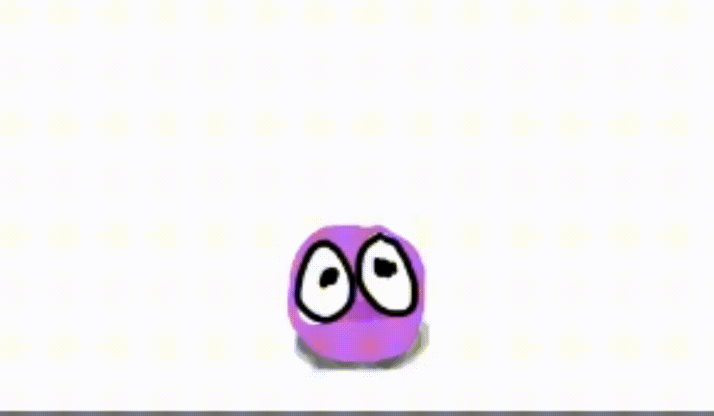
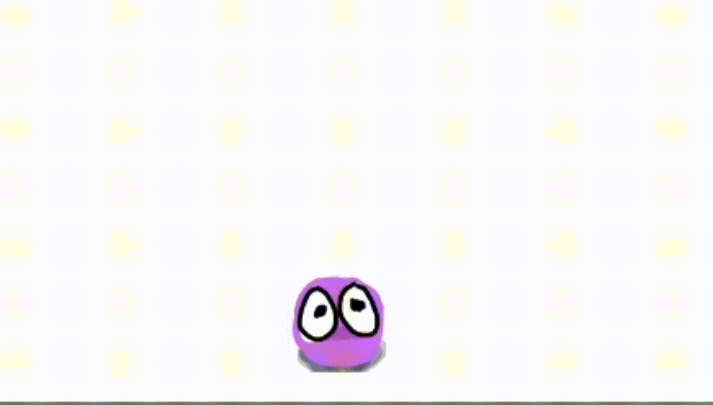
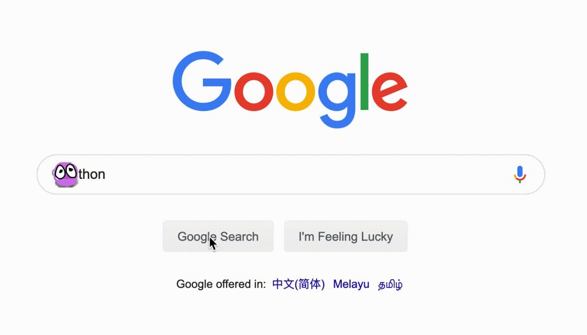
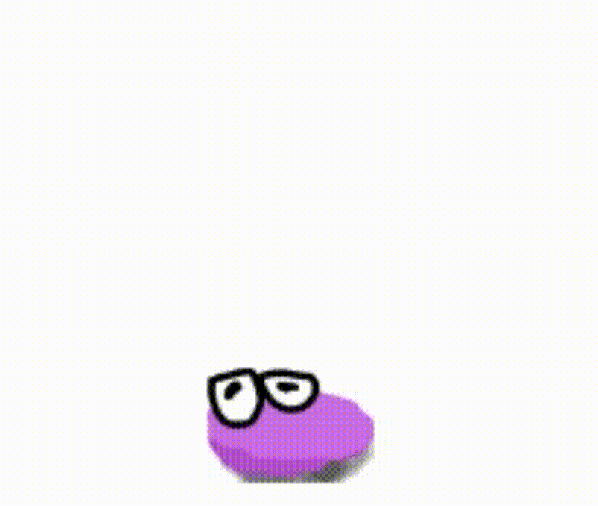
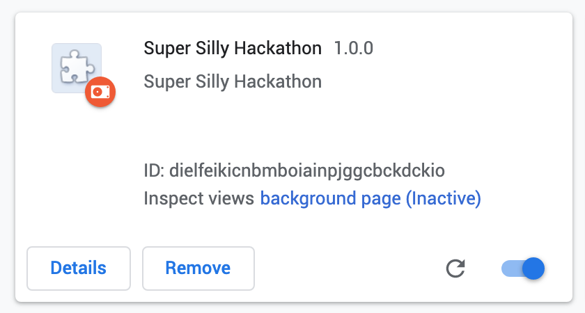

I just came back from the [Super Silly Hackathon 2019](https://supersillyhackathon.sg/). It was my second time to participate in this Super Silly Hackathon.

<blockquote class="twitter-tweet"><p lang="en" dir="ltr">Hello everybody we are ready for this year, are you?? <a href="https://t.co/lem52qHO6Q">pic.twitter.com/lem52qHO6Q</a></p>&mdash; Super Silly Hackathon — 14 Dec 2019 (@supersillyhack) <a href="https://twitter.com/supersillyhack/status/1205671402432450563?ref_src=twsrc%5Etfw">December 14, 2019</a></blockquote>

This year, my silly hackathon idea is to build [a little pet in the browser](https://github.com/tanhauhau/browser-pet)!



## Inspiration?

I saw the [tamagotchi](https://github.com/graceavery/tamagotchiTemp) on touchbar a while ago, I don't have a touchbar, but I have a browser. So why not create a pet in the browser through Chrome Extension?

## What can it do?

#### 1. It runs away from mouse cursor



#### 2. It eats whatever you try to type into an input


#### 3. It annihilates the buttons you hover onto



## Implementation

### Chrome Extension

Firstly, it is a Chrome Extension. I used [Content Scripts](https://developer.chrome.com/extensions/content_scripts), so that I have access to the DOM of the pages I am visiting.

Here is my `manifest.json` for my extension:

```json
{
  "manifest_version": 2,
  "name": "Super Silly Hackathon",
  "description": "Super Silly Hackathon",
  "version": "1.0.0",
  "content_scripts": [
    {
      "matches": ["<all_urls>"],
      "js": ["content.js"],
      "css": ["content-ext.css"],
      "run_at": "document_start",
      "all_frames": true
    }
  ]
}
```

To start, I added an `onload` event, to add my pet into the browser:

```js
/// filename: content.js
function onload() {
  const pet = document.createElement('div');
  updatePosition(100, 100);
  pet.classList.add('ssh-pet');
  document.body.appendChild(pet);
}
window.addEventListener('load', onload);
```

```css
/* filename: content.css */
.ssh-pet {
  height: 30px;
  width: 30px;
  position: fixed;
  z-index: 1000;
  background-image: url('/images/rest.png');
  background-size: 30px 30px;
  background-position: 0 0;
}
```

The first problem I encountered, is that I couldn't access the `/images/rest.png`. After some googling, I need to:

#### 1. Add `web_accessible_resources` into the `manifest.json`

```json
{
  // ...
  "web_accessible_resources": ["images/*"]
}
```

#### 2. Prepend `chrome-extension://__MSG_@@extension_id__/` for the URL

```css
.ssh-pet {
  /* ... */
  background-image: url('chrome-extension://__MSG_@@extension_id__/images/rest.png');
}
```

### Make it look alive

A static image will look fake.

As the quote says, **"eyes is the window to the soul"**, to make the pet look real, we need to make the eye blink.

_(That's how you judge a person is dead or alive in movies right? Dead body will just stare blankly to nowhere)_

To make the pet blink, I found some [useful tutorials](https://blog.teamtreehouse.com/css-sprite-sheet-animations-steps) on how to create CSS sprite sheet animations.


```css
@keyframes ssh-pet-rest {
  0% {
    background-position-x: 0;
  }
  100% {
    background-position-x: -90px;
  }
}

.ssh-pet.rest {
  background-image: url('chrome-extension://__MSG_@@extension_id__/images/rest-sprite.png');
  background-repeat: repeat-x;
  background-size: 90px 30px;
  background-position: 0 0;
  animation: ssh-pet-rest 0.2s steps(3);
}
```

To animate it, I added the `rest` class to the pet, and removed it when it's done animating.

```js
pet.classList.add('rest');
// when the animation finished, remove the class
const onanimationend = () => {
  pet.removeEventListener('animationend', onanimationend);
  pet.classList.remove('rest');
};
pet.addEventListener('animationend', onanimationend);
```

At the beginning, I thought I would add more other micro expressions to the pet, so I wrote a scheduler, to schedule expressions randomly:

```js
async function doSomething(random) {
  switch (random) {
    case 0:
    // ...
    default:
      return animateRest();
  }
}

function scheduleSomething() {
  setTimeout(async () => {
    const choices = 10;
    // cheat to do Math.floor
    const random = ~~(Math.random() * choices);
    await doSomething(random);
    scheduleSomething();
  }, 800 + Math.random() * 1000);
}

// make animation promise based
function animateRest() {
  return animateClass('rest');
}
function animateClass(cls) {
  return new Promise(resolve => {
    pet.classList.add(cls);
    const onanimationend = () => {
      pet.removeEventListener('animationend', onanimationend);
      pet.classList.remove(cls);
    };
    pet.addEventListener('animationend', onanimationend);
  });
}
```

I used `await` to wait for animation to finish, before schedule the next action again, so that it will not have 2 actions running in parallel.

### Avoid the cursor

I drew a sprite sheet that make the pet looks like it is squiggling away,



while at the same time set the `transform: translateX()` to actually move it:

```css
@keyframes ssh-pet-shift-left {
  0% {
    background-position-x: 0;
    /* highlight-next-line */
    transform: translateX(0);
  }
  100% {
    background-position-x: -240px;
    /* highlight-next-line */
    transform: translateX(-30px);
  }
}

.ssh-pet.shift-left {
  background-image: url('/images/shift-left-sprite.png');
  background-repeat: repeat-x;
  background-size: 240px 30px;
  background-position: 0 0;
  animation: ssh-pet-shift-left 0.8s steps(8);
}
```

In JavaScript, I tried to keep the position state inside an object:

```js
const position = { x: 0, y; 0 };

function offsetPosition(x, y) {
  updatePosition(position.x + x, position.y + y);
}
function updatePosition(x, y) {
  pet.style.left = (position.x = x) + 'px';
  pet.style.top = (position.y = y) + 'px';
}
```

So, to shift away from the cursor would be:

```js
async function animateShiftLeft() {
  await animateClass(`shift-left`);
  offsetPosition(-30, 0);
}
```

So, when the animation ends, the `transform: translateX()` will go from `-30px` back to `0`, and at the same time, I moved the position of the pet `-30px` in x-axis.

To know when the cursor is on top of the pet, I used `mousemove` event:

```js
pet.addEventListener('mousemove', async event => {
  if (!animating) {
    animating = true;
    await shiftAway();
    animating = false;
  }
});

// edge avoidance shifting
async function shiftAway() {
  if (position.x < 40) {
    await animateShiftRight(true);
  } else if (position.x > window.innerWidth - 40) {
    await animateShiftLeft(true);
  } else if (Math.random() > 0.5) {
    await animateShiftLeft(true);
  } else {
    await animateShiftRight(true);
  }
}
```

To avoid reanimate while still animate, I added a `animating` flag, as an mutex.

Besides, it would be weird to see the pet shifting pass through the browser window, because that way, you would never be able to interact with it anymore 😢

### Eating the characters

To know when someone is typing into any of the input box, I attach an `input` event listener on to the `document.body`:

```js
document.body.addEventListener('input', async event => {
  debounceByElement(event.target, eatInputValue, 1000);
});
```

There maybe multiple `<input />` on the page, so I created a debounce function for each `<input />`.

To make the eating simple, I will always eat from the left, consuming characters from left to right:

```js
function eatInputValue(elem) {
  elem.value = elem.value.slice(1);

  debounceByElement(event.target, eatInputValue, 1000);
}
```

However naively eating the characters this way, will screw up your cursor position / selection.
So I googled and pasted the code snippet to improve it:

```js
function eatInputValue(elem) {
  // highlight-start
  // remember selection position
  const start = elem.selectionStart,
    end = elem.selectionEnd;
  // highlight-end
  elem.value = elem.value.slice(1);
  // highlight-start
  // restore selection position
  elem.setSelectionRange(Math.max(start - 1, 0), Math.max(end - 1, 0));
  // highlight-end

  debounceByElement(event.target, eatInputValue, 1000);
}
```

After able to "eat" the characters, I need to animate the pet eating the characters


To align the eating with the removing of a character, I split the animation into 2 parts, **the eating** and **the chewing** _(I named it digesting during the hackathon)_.

```js
function eatInputValue(elem) {
  // highlight-next-line
  await animateClass('eat');

  const start = elem.selectionStart,
    end = elem.selectionEnd;
  elem.value = elem.value.slice(1);
  elem.setSelectionRange(Math.max(start - 1, 0), Math.max(end - 1, 0));
  // highlight-next-line
  await animateClass('digest');

  debounceByElement(event.target, eatInputValue, 1000);
}
```

To make it more realistic, I tried to make the pet tilt forward, while consuming the character:

```css
@keyframes ssh-pet-eat-move {
  0%,
  30% {
    transform: translateX(0);
  }
  50% {
    transform: translateX(4px);
  }
  100% {
    transform: translateX(0);
  }
}
```

The pixel values had been tuned to make the movement subtle, yet natural.

Now, how do I place my pet to the left of the input?

Instead of squiggle to the right position, I made the pet **teleport**!

```js
async function animateTeleport(x, y) {
  await animateClass('disappear');
  pet.style.opacity = 0;
  updatePosition(x, y);
  pet.style.opacity = 100;
  await animateClass('reappear');
}
```

To calculate the teleport destination, I used [getBoundingClientRect()](https://developer.mozilla.org/en-US/docs/Web/API/Element/getBoundingClientRect):

```js
function leftSideOf(elem) {
  const { x, y, height } = elem.getBoundingClientRect();
  const to_x = x - pet.size.width + paddingLeft(elem);
  const to_y = y + height / 2 - pet.size.height / 2;
  return [to_x, to_y];
}

function paddingLeft(elem) {
  return (
    Number(
      window
        .getComputedStyle(elem)
        .getPropertyValue('padding-left')
        .replace(/px|r?em/, '')
    ) || 0
  );
}
```

The padding of the input is important. It brings the pet closer to the character it is going to eat. 🤤

### Annihilate the buttons

Pet don't like buttons because buttons take away your concentration from your pet.


To get a list of buttons, I use [document.querySelectorAll()](https://developer.mozilla.org/en-US/docs/Web/API/Document/querySelectorAll):

```js
const buttons = document.querySelectorAll('button, input[type="submit"], [role="button"]');
buttons.forEach(button =>
  button.addEventListener('mousemove', mouseMove)
);
```

To annihilate the buttons, I animated the pet with a pair of dead red eyes, and shake it for 400 milli-seconds, before annihilating the elements into vapor:

```js
async function removeTheElement(elem) {
  if (animating) {
    return;
  }

  animating = true;
  pet.classList.add('hate');
  await timeout(400);

  elem.removeEventListener('mousemove', mouseMove);

  await animateClass('item-disappearing', elem);
  elem.style.visibility = 'hidden';
  pet.classList.remove('hate');
  animating = false;
}
```

I used `visibility: hidden`, so that I dont disrupt the DOM structure, yet making it disappear and unclickable, unlike `opacity: none`.

The pet with hatred is slightly bigger and agitated than the normal pet:

```css
@keyframes hating {
  0% {
    transform: scale(1.1) translateX(-2px)
  }
  50% {
    transform: scale(1.1) translateX(2px)
  }
  100% {
    transform: scale(1.1) translateX(-2px)
  }
}
```

To turn the button annihilated into vapor, I used `filter: blur()`:

```css
@keyframes item-disappearing {
  0% {
    filter: blur(0px);
  }
  80% {
    opacity: 1;
  }
  100% {
    filter: blur(8px);
    transform: scale(1.5);
    opacity: 0;
  }
}
```

## Difficulties

### Synchronising interactions
A lot edge cases has been found and fixed by using the `animating`, or `eating` flag:
- where to avoid cursor, while eating the characters
- to annihilate or to eat?
There's an heuristic to choose which one to do, when both get scheduled at the same time.

### Developing locally
Everytime when the content script is updated, I need to click refresh in the `chrome://extensions` page:



In order to developed faster, I created a simple HTML, and test it locally.

```html
<html>
  <link rel="stylesheet" type="text/css" href="content.css" />
  <body>
    <script src="content.js"></script>
  </body>
</html>
```

#### PostCSS script

Remember I mentioned that, for resource to be accessible from the Chrome Extension, I would have to prepend the url with `chrome-extension://__MSG_@@extension_id__/`?

But that does not work if I developed in standalone HTML, because I can't access the assets from `chrome-extension://` protocol in my localhost.

I would have to write `/images/rest.png`, and replaced it to `chrome-extension://__MSG_@@extension_id__/images/rest.png` when I test it on my extension.

So, I wrote a simple script with [PostCSS](https://postcss.org/) to automatically do it:

```js
const fs = require('fs');
const path = require('path');
const postcss = require('postcss');

const input = path.join(__dirname, '../content.css');
const output = path.join(__dirname, '../content-ext.css');

// watch when file change
fs.watchFile(input, () => {
  const css = fs.readFileSync(input, 'utf-8');
  // NOTE: `from: undefined` to stop PostCSS complain about sourcemap
  postcss([replaceUrl]).process(css, { from: undefined }).then((result) => {
    fs.writeFileSync(output, result.css, 'utf-8');
  });
});

function replaceUrl(root) {
  root.walkDecls('background-image', decl => {
    decl.value = decl.value.replace(/url\('(.*)'\)/, "url('chrome-extension://__MSG_@@extension_id__$1')");
  });
}
```

I used `content.css` for my local development, and automatically built `content-ext.css` for the extension with all the URL replaced.

## Demo

I did a super quick demo, which went quite well, _I think._ 🤔

For those who are curious, and want to try out, you can visit [here for the demo](https://lihautan.com/browser-pet/).

For those who are curious about the source code, can visit [the Github repo](https://github.com/tanhauhau/browser-pet).

## Summary

It has been a fruitful event.

<blockquote class="twitter-tweet"><p lang="en" dir="ltr">And <a href="https://twitter.com/lihautan?ref_src=twsrc%5Etfw">@lihautan</a> wins a bag of tropical fruits <a href="https://t.co/CtQUBGOI7h">pic.twitter.com/CtQUBGOI7h</a></p>&mdash; Yishu See (@yishusee) <a href="https://twitter.com/yishusee/status/1205828141194727430?ref_src=twsrc%5Etfw">December 14, 2019</a></blockquote>

Appreciate the organisers time and effort to make the Hackathon goes as smoothly as possible.

I managed to do something that I never really done before:
- CSS sprite sheet animation
- Chrome Extension that interacts with the user and manipulates the DOM

Hopefully I will partcipate the [Super Silly Hackathon](https://twitter.com/supersillyhack) again next year.